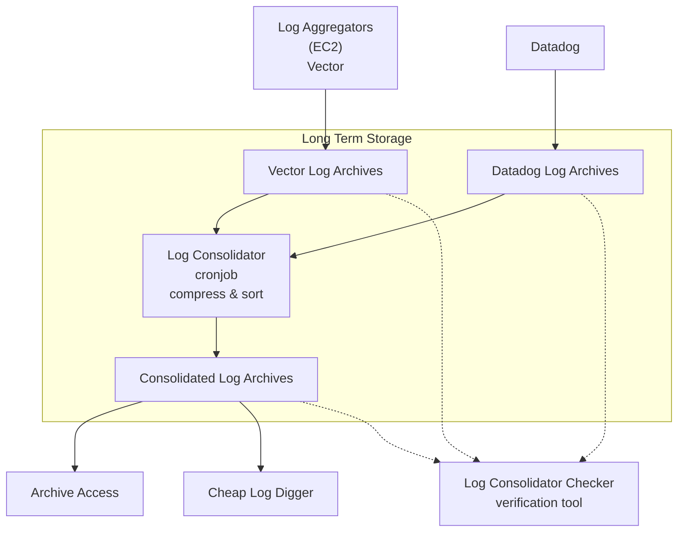

# Log Consolidator Checker

A Rust-based CLI tool for verifying log consolidation in S3 buckets. This tool parses YAML configuration files and can check S3 files between specified dates.

## Architecture

The Log Consolidator Checker operates within the following log processing architecture:



The Log Consolidator Checker reads from input buckets (Vector and Datadog archives) and output buckets (Consolidated archives) to verify that all logs have been properly consolidated.

## Log Format Specifications

### Input Buckets

#### Vector Log Archives Bucket
- **AWS Console**: `support-infra-raw-logs-archives`
- **Format**: JSONLines+GZip
- **File naming**: `YYYY/MM/DD/HH/xxxx.zip`
- **Characteristics**: Files have no trailing newlines
- **Content**: Logs from aggregators not sent to Datadog

#### Datadog Log Archives Bucket
- **AWS Console**: `support-infra-datadog-logs-rehydrate-archives`
- **Format**: JSONLines+GZip
- **File naming**: `datadog/dt=YYYYMMDD/h=HH/xxxx.zip`
- **Characteristics**: Files have trailing newlines
- **Content**: All logs sent to Datadog, regardless of indexing or retention

### Output Buckets

#### Consolidated Log Archives Bucket
- **AWS Console**: `support-infra-log-consolidator-archives`
- **Format**: JSONLines+Zstd
- **File naming**: `log-archives/dt=YYYYMMDD/h=HH/env-service.json.zst`
- **Errata files**: `log-archives-errata/<erratum-id>/dt=YYYYMMDD/h=HH/env-service.json.zst`
- **Characteristics**:
  - ~60% smaller than input files due to zstd compression
  - Organized by environment and service for efficient access
  - Enables per-environment/per-service retention policies

## Features

- Parse YAML configuration files for bucket information
- List files in S3 buckets between date ranges
- Check log consolidation for specific dates/hours
- Filter files by patterns and extensions
- Optimized with async/await for performant S3 operations
- Uses Tokio runtime for asynchronous processing

## Installation

```bash
# Clone the repository
git clone https://git.manomano.tech/pulse/observability/log-consolidator-checker-rs#
cd log-consolidator-checker-rs

# Build the project
cargo build --release
```

## Usage

```bash
# List files between dates
./target/release/log-consolidator-checker -c config.yaml list --start "2023-01-01T00:00:00Z" --end "2023-01-01T03:00:00Z"

# Check consolidation for a specific date/hour
./target/release/log-consolidator-checker -c config.yaml check --date 20230101 --hour 00
```

## Configuration

Create a YAML file with your bucket configuration:

```yaml
bucketsToConsolidate:
  - bucket: source-logs-bucket-1
    path:
      - static: logs
      - datefmt: 2006/01/02/15
    only_prefix_patterns:
      - "^app-.*\\.json\\.gz$"
      - "^api-.*\\.json\\.zst$"
    proceed_without_matching_objects: false

bucketsConsolidated:
  - bucket: destination-logs-bucket
    path:
      - static: consolidated-logs
      - datefmt: dt=20060102/hour=15
    proceed_without_matching_objects: false

bucketsCheckerResults:
  - bucket: logs-check-results-bucket
    path:
      - static: check-results
      - datefmt: dt=20060102/hour=15
    proceed_without_matching_objects: true
```

## Authentication

This tool uses the AWS SDK for Rust, which automatically loads credentials from:
- Environment variables
- AWS credentials file (~/.aws/credentials)
- IAM instance profiles (when running on EC2)
- IAM roles for tasks (when running on ECS)

## Performance Tuning

This program will use 1/2GB + the size of the raw downloaded files (pending decompression) in a so called memory pool.
It has been seen processing 250MB/s (_on average_) for 30GB+ of data, over 32 cores and 12GB of pool.

- Use `--max-parallel` to control the amount of simultaneous downloads. Defaults to 32.
  - Smaller files require more parallel downloads to maximise throughput.
  - The actual amount of parallel downloads is generally limited by the memory pool size.
  - If the memory pool size is underused, add download threads!
  - If the memory pool size is fully used, you may increase its size. You do not need to lower max-parallel in that case.
  - If the amount of S3 errors and/or retries is high, you need to decrease max-parallel.
- Use `--memory-pool-mb` to size the download pool.
    - 12GB is enough to serve 128 download threads and 30 processing threads on 32 cores.
- Use `--process-threads` to control the amount of processing threads. Defaults to `CPU_COUNT - 2`.
    - We're aiming for close to 100% utilization here, which will be spend on decompression and character counting tasks.
